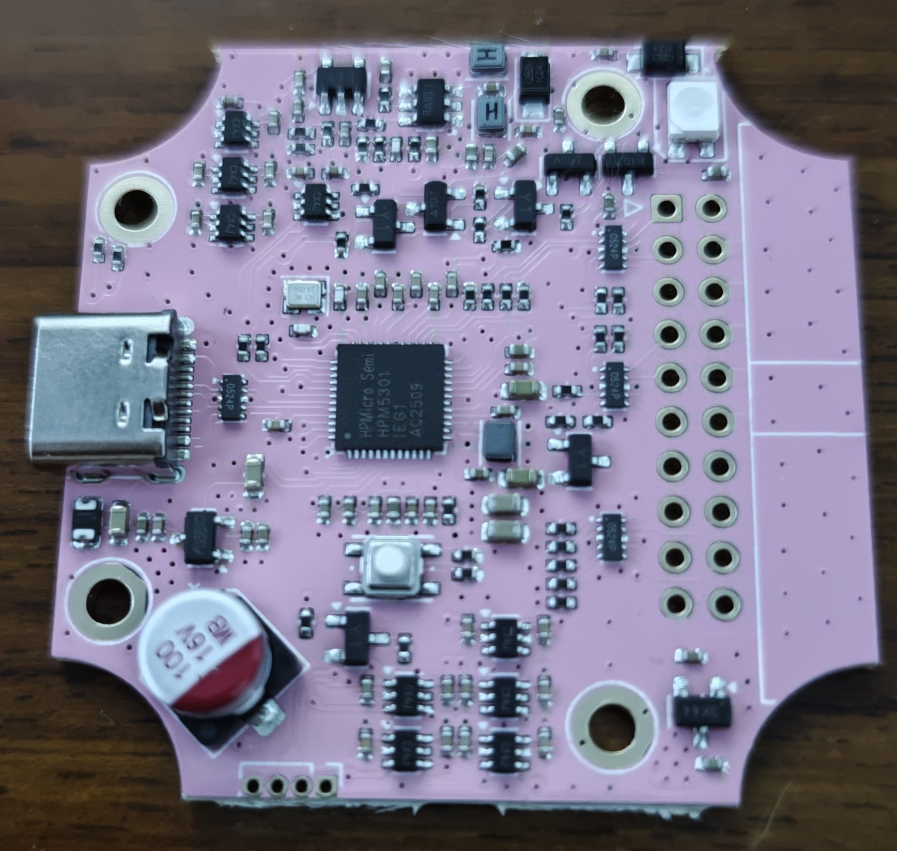
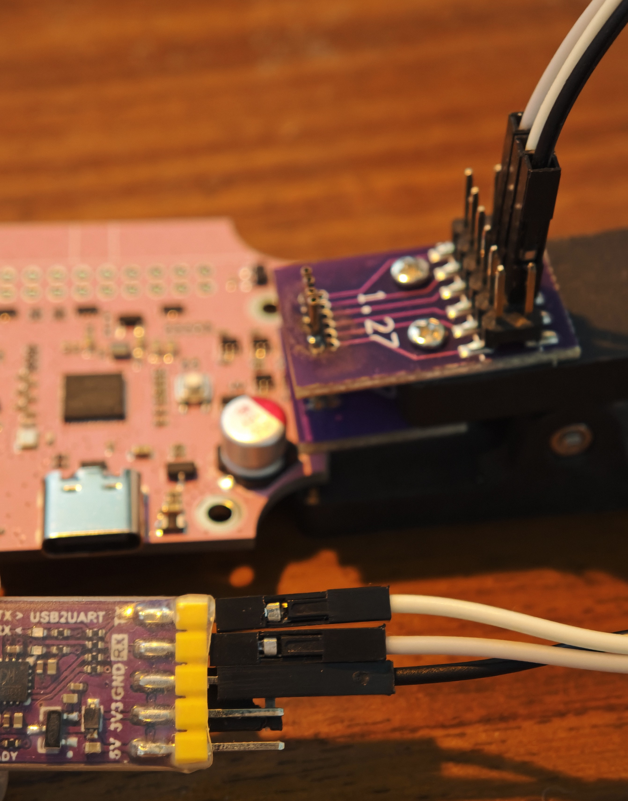
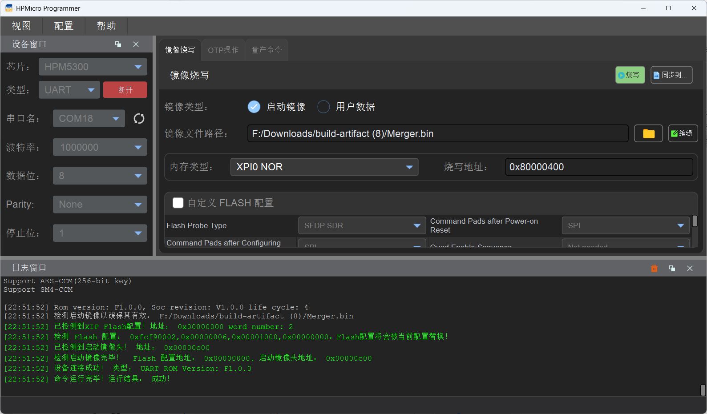
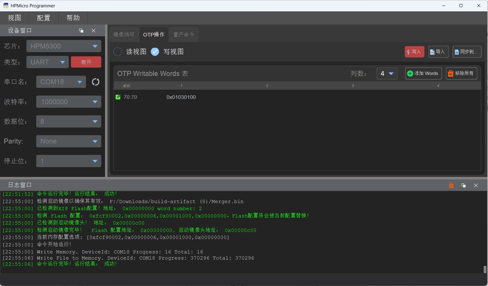
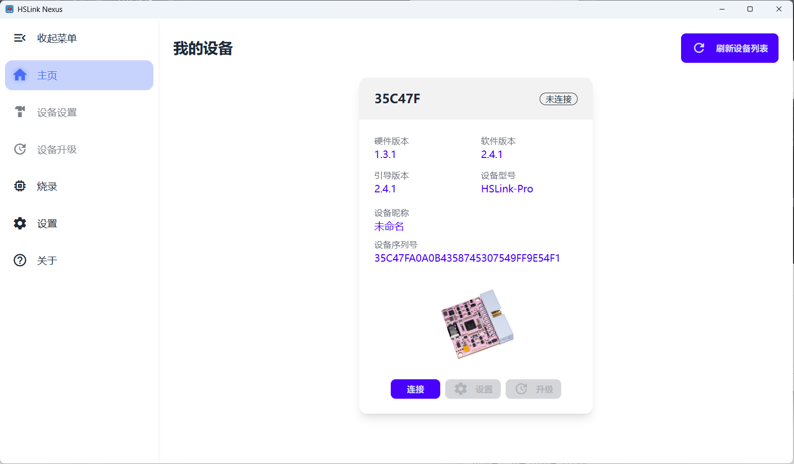

# 制作指南

## 制版及贴片

选择你喜欢的板厂打板。

根据自身情况选择smt或者手工焊接。

得到一块焊完的PCB。

## 烧录线连接

使用1.27的测试夹，或是直接焊线，将USB转串口连接到PCB左下角的烧录点。参照背面对应位置的丝印，GND连接GND，TX接RX，RX接TX，3V不连接。

## 连接电脑烧录

按住按键后插入PCB的Type-C接口，再插入USB转串口的USB接口。

打开HPM的上位机选择对应的串口，速率拉高后点击连接

选择固件压缩包中的Merge.bin文件，点击烧写。

切换到OTP页面，烧写版本号。注意OTP仅能进行一次烧写。

## 连接上位机

拔掉调试器再插入，即可连接到上位机

## 外壳

可配合鹿小班等外壳，使用M2.2*4的自攻螺丝进行固定。